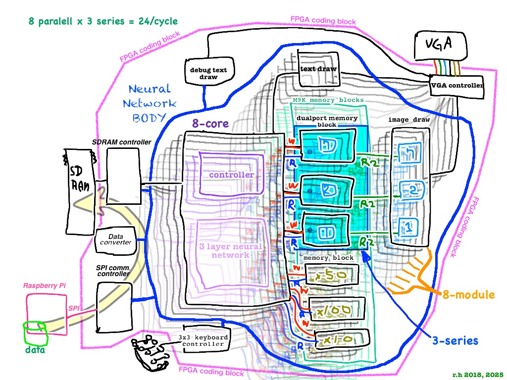

# fpgaNeuralNetPara8
FPGAでニューラルネットワークの推論を組み込んで実験しました。いわゆるニューラルネットワークチップというものです。
2018年頃、電子工作で作りました。AIチップをどうやってFPGAで組むのか、その手助けになればと、参考用に、古いコードを公開することにしました。

1.17秒で4992文字をAI判定させます。

回路は、1コアにつき3個のスレッド、それを8段重ねて、合計24個のスレッドが同時に画像イメージを判定します。
画面上に表示されている画像と、その上に推論の、第１候補、第2候補、通し番号、が表示されます。
画像の3段目が緑色なのは、論理回路の制限で、評価ボードの論理数が不足した為、その部分の結線をあきらめた空白です。

FPGAボードは terasic DE0-Nano (ALTERA Cyclone IV EP4CE22F17C6N FPGA)　です。  
開発ツールはQuartus Prime Version 17 Lite Edition（無償版）です。  
表示は標準の液晶モニター、VGA（640x480）です。

テスト用の画像データは、あらかじめ用意しておいたRaspberryPiにあります。
そこから転送プログラムでSPI通信を通し、FPGAボード側で受信したのち、SDRAMに書き込みます。
学習済みデータはFPGA（Cyclone IV）内部のエンベデッド・メモリー（M9K）に置きます。
FPGAからVGA接続した液晶モニターに判定画像と判定結果を表示します。

SPI通信と、SDRAMコントローラと、VGA表示回路は自作しました。
DRAM制御はバーストモードを使っているので、最速に近いと思います。リフレッシュも限界までチューニングしました。

テストデータと学習データは教科書にある、古典的なものです。参考書やネットでも見つかります。
ニューラルネットは3段です。整数計算を１ビットずつ、限界ギリギリまで削って、回路数を節約してあります。

2018年に、なぜ、ここまで情熱的に、AIの電子回路を作ろうと思ったのか今思うと不思議ですね。
世界中で同時期に似たような発明がされていたので、人類のマイルストーンの一つ、なのかな。

Verilogで組んだニューラルネットのコードは難解なので、ダイアグラム（図）も用意しました。

Verilogで書かれたコード.vファイルのインデント（字下げ）が見づらいのでブラウザのURL欄の文末に「?ts=3」をつけると
空白が揃うようになります。

ソースコードのフォルダの説明

connectKey3x3.v　押しボタンスイッチのキーボードの回路です
connectSDRAM.v　　SDRAMのコントローラーです。特別に高速化したもので一般の使用には不向きです
connectSPI01.v　　SPI通信のコントローラーです。自作しました
connectVGA.v　　　VGA表示回路です。VGAと接続するためのラダー抵抗が必要になります
imageDraw784.v　　描画モジュールです
memoryM9K.v　　　　エンベデッド・メモリー（M9K）の読み書き
memoryM9K100W.v　　エンベデッド・メモリー（M9K）のニューラルネットの1段目だったかな....
memoryM9K10W.v　　　エンベデッド・メモリー（M9K）のニューラルネットの3段目だったか....
memoryM9K50W.v　　　エンベデッド・メモリー（M9K）のニューラルネットの2段目だったかも....
memoryM9Kdual.v　　　エンベデッド・メモリー（M9K）の何か
procMemory01.v　　　　メモリの操作全般
receiveDataConv.v　　　受信モジュール
testNeuralNet01.v　　　メイン処理です
textDraw02.v　　　　　　画面の描画をします
textDraw03.v　　　　　　画面の描画をします
testNeuralNet01.qpf　　プロジェクトファイル
testNeuralNet01.qsf　　プロジェクトの設定ファイル
testNeuralNet01.qws　　プロジェクトのウインドウ情報（いらないかも）
testNeuralNet01.sdc　　プロジェクトのタイミング制約用ファイル
txt　　テキスト表示のフォントデーターです。自作しました

VGA output.

circuit diagram of this code.

r.h 2025/5/20
